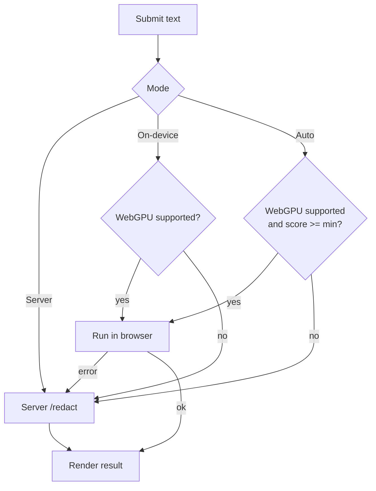

# OpenAI Privacy Filter API

English | [简体中文](./README.zh-CN.md)

FastAPI wrapper for [OpenAI Privacy Filter](https://github.com/openai/privacy-filter), with Docker, Docker Compose, and GitHub Container Registry publishing support.

This project helps you turn OpenAI Privacy Filter into a small self-hosted API service **and a browser-based web interface** for PII detection and text redaction.

The web interface mirrors the official [openai/privacy-filter Hugging Face Space](https://huggingface.co/spaces/openai/privacy-filter): paste text, detect and highlight personal identifiers, and get a redacted output with label placeholders.

## Why This Project

OpenAI Privacy Filter is a strong local model for detecting and masking sensitive text such as names, emails, phone numbers, dates, addresses, account numbers, private URLs, and secrets. The upstream repo ships a Python package and CLI. This repo adds the missing deployment layer many teams want:

- Simple REST API with FastAPI
- Built-in web interface served from the same app
- Optional on-device (WebGPU) inference with automatic server fallback
- Local-first deployment
- Docker and Docker Compose support
- GitHub Actions workflow to publish container images
- Small integration surface for internal tools, RAG pipelines, ETL jobs, and document preprocessing

If you want to run OpenAI Privacy Filter as a backend service instead of calling the CLI directly, this repo is for you.

## Use Cases

- Redact PII before sending text to an LLM
- Sanitize support tickets, chat logs, and transcripts
- Clean internal documents before indexing into RAG systems
- Build a privacy gateway for AI apps
- Add an on-prem redaction layer to compliance-sensitive workflows

## Features

- `GET /` interactive web interface (highlighted entities, redacted output, summary)
- `GET /webgpu` on-device (WebGPU) web interface with automatic server fallback
- `GET /health` health check
- `GET /config` client-inference configuration for the WebGPU page
- `POST /redact` full redaction response for a single text (spans + summary)
- `POST /redact/text` text-only redaction response
- `POST /redact/batch` batch redaction response with detected spans and latency
- Configurable model device and checkpoint through environment variables
- Docker image build and Compose-based local startup
- pm2-managed deployment via `setup.sh` / `run.sh` / `stop.sh` and `ecosystem.config.js`

## Web Interface

After starting the service, open <http://127.0.0.1:8080/> in your browser.

The page provides:

- A text input for content that may contain PII
- A "Detect & Redact" action that highlights detected entities
- A redacted text output with a copy button
- A per-label summary of detected entities
- Multilingual quick examples

The interface is a static single page (`src/web/index.html`) that calls the
`POST /redact` endpoint, so it works anywhere the API runs.

## On-device WebGPU Version

There are two front-ends:

| Page | URL | Where the model runs |
| --- | --- | --- |
| Server version | `/` | Always on the server (`openai/privacy-filter`) |
| WebGPU version | `/webgpu` | On your device via WebGPU, with automatic server fallback |

Open <http://127.0.0.1:8080/webgpu> to use the on-device variant. It has three modes:

- **Auto** (default): runs in the browser with WebGPU **if** the browser supports
  it *and* the device looks capable; otherwise it uses the server model. A
  software/fallback WebGPU adapter scores `0`, so weak machines automatically use
  the server even when WebGPU is technically "supported".
- **On-device (WebGPU)**: forces in-browser inference — text never leaves the
  machine. The first run downloads the model (cached afterward).
- **Server**: always uses the higher-fidelity backend model.

On-device detection combines an in-browser NER model (names & locations, run with
WebGPU via [transformers.js](https://github.com/huggingface/transformers.js)) with
local regex detectors for structured PII (email, phone, URL, date, account
numbers, secrets). It is an approximation of the server model and may differ from
its results. If on-device inference fails for any reason, the request transparently
falls back to the server.

How the engine is chosen and falls back:



Relevant settings live in `.env` (exposed to the page via `GET /config`):

- `OPF_CLIENT_ENABLE`: set to `false` to force every request to the server
- `OPF_CLIENT_MODEL`: override the in-browser token-classification model id
- `OPF_TRANSFORMERS_URL`: override the transformers.js module URL (e.g. self-hosted)
- `OPF_CLIENT_MIN_SCORE`: device capability score (0-100) required for Auto to run on-device

## API Overview

### `GET /health`

Returns service status and whether the model is loaded.

### `POST /redact`

Returns the full redaction result for a single text, including the original
text, redacted text, detected spans, and a summary. This is the endpoint used
by the web interface.

Request:

```json
{
  "text": "Email me at alice@example.com"
}
```

Response:

```json
{
  "schema_version": 0,
  "text": "Email me at alice@example.com",
  "redacted_text": "Email me at [EMAIL]",
  "detected_spans": [
    {
      "label": "private_email",
      "start": 12,
      "end": 29,
      "text": "alice@example.com",
      "placeholder": "[EMAIL]"
    }
  ],
  "summary": { "output_mode": "typed", "span_count": 1, "by_label": { "private_email": 1 }, "decoded_mismatch": false },
  "warning": null,
  "latency_ms": 123.45
}
```

### `POST /redact/text`

Request:

```json
{
  "text": "Alice lives at 1 Main Street and her email is [email protected]"
}
```

Response:

```json
{
  "redacted_text": "[PRIVATE_PERSON] lives at [PRIVATE_ADDRESS] and her email is [PRIVATE_EMAIL]",
  "latency_ms": 123.45
}
```

### `POST /redact/batch`

Request:

```json
{
  "texts": [
    "Alice was born on 1990-01-02.",
    "Call Bob at +1 415 555 0114."
  ]
}
```

Returns per-item redaction results, detected spans, summary metadata, and total latency.

## Quick Start

### 0. Lifecycle Scripts with pm2 (recommended)

The repo ships three scripts that wrap setup and process management. Deployment
is managed by [pm2](https://pm2.keymetrics.io/), which keeps the service alive
(auto-restart), centralizes logs, and can resurrect it on reboot.

```bash
./setup.sh   # create .venv, install torch + privacy-filter + API deps + pm2, create .env
./run.sh     # start (or reload) the web interface + API under pm2
./stop.sh    # stop and remove the pm2 process
```

- `setup.sh` installs pm2 globally via npm (set `SKIP_PM2=1` to skip; requires
  Node.js). If a global install isn't possible, `run.sh`/`stop.sh` fall back to
  `npx pm2`.
- `run.sh` uses `ecosystem.config.js` and `pm2 startOrReload`, so re-running it
  performs a zero-downtime reload. Pass `--foreground` (or `-f`) to bypass pm2
  and run uvicorn directly in the foreground (useful for debugging).
- `stop.sh` deletes the pm2 process; pass `--keep` (or `-k`) to only stop it so
  `pm2 restart openai-privacy-filter` works later.
- Host and port are read from `.env` (`HOST`, `PORT`), defaulting to `0.0.0.0:8080`.

Useful pm2 commands:

```bash
pm2 status                       # list processes
pm2 logs openai-privacy-filter   # tail logs
pm2 restart openai-privacy-filter
pm2 startup && pm2 save          # enable start-on-boot
```

Once running, open <http://127.0.0.1:8080/> for the web UI or
<http://127.0.0.1:8080/docs> for the API docs.

### 1. Local Python Run

```bash
python -m venv .venv
source .venv/bin/activate
pip install -r requirements.txt
pip install ./privacy-filter
python main.py
```

The API and web interface start on `http://127.0.0.1:8080`.

### 2. Docker

CPU image:

Build the image:

```bash
docker build -t openai-privacy-filter .
```

Run the container:

```bash
docker run --rm -p 8080:8080 --env-file .env openai-privacy-filter
```

### 3. Docker Compose

Start the service:

```bash
docker compose up --build
```

Run in the background:

```bash
docker compose up --build -d
```

Stop it:

```bash
docker compose down
```

## Environment Variables

Common options:

- `PORT`: API port, default `8080`
- `OPF_DEVICE`: `cpu`, `cuda`, `mps`, or `auto`; default `cpu`
- `OPF_OUTPUT_MODE`: OpenAI Privacy Filter output mode, default `typed`
- `OPF_CHECKPOINT`: optional custom checkpoint path

Example `.env`:

```env
PORT=8080
OPF_DEVICE=cpu
OPF_OUTPUT_MODE=typed
```

## Positioning

This is not the official OpenAI repo. It is a deployment-focused wrapper around the official OpenAI Privacy Filter project.

Upstream project:

- [openai/privacy-filter](https://github.com/openai/privacy-filter)

If you need the core model, training flow, or evaluation tooling, start with the upstream repo. If you want to expose it as an API service quickly, use this repo.

## SEO Keywords

OpenAI Privacy Filter API, OpenAI Privacy Filter FastAPI, PII redaction API, PII masking service, self-hosted privacy filter, Docker privacy filter, local PII detection, OpenAI privacy filter server, privacy filter for RAG, privacy filter for LLM preprocessing.

## License

This wrapper repo does not change the upstream model license. Review the upstream project for model and code licensing details:

- [OpenAI Privacy Filter license](https://github.com/openai/privacy-filter)
