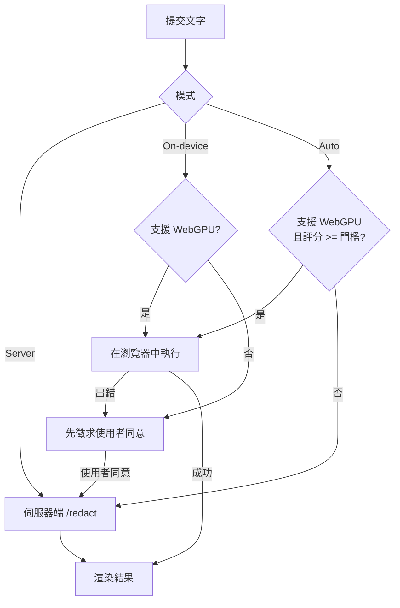

# OpenAI Privacy Filter API

[English](./README.md) | 繁體中文

這是一個基於 [OpenAI Privacy Filter](https://github.com/openai/privacy-filter) 的 FastAPI 封裝專案，內建 Docker、Docker Compose，以及 GitHub Container Registry 發佈工作流程。

如果你想把 OpenAI Privacy Filter 快速部署成一個可呼叫的本地 API 服務**以及一個瀏覽器網頁介面**，而不是只在命令列裡使用，這個專案就是為這個情境準備的。

網頁介面參考了官方的 [openai/privacy-filter Hugging Face Space](https://huggingface.co/spaces/openai/privacy-filter)：貼上文字、偵測並高亮個人敏感資訊，並產生帶有佔位符的脫敏結果。

## 這個專案解決什麼問題

OpenAI Privacy Filter 本身已經提供了很強的本地隱私過濾能力，可以辨識並遮蓋文字中的敏感資訊，例如：

- 人名
- 電子郵件
- 電話號碼
- 地址
- 日期
- 帳號號碼
- 私有 URL
- 金鑰與權杖

上游儲存庫主要提供模型、Python 套件和 CLI。本專案補上了更適合落地部署的一層：

- 基於 FastAPI 的 REST API
- 內建網頁介面，與 API 在同一個服務一起提供
- 可選的裝置端（WebGPU）推理，並自動回退到伺服器端
- 支援本地與私有化部署
- 支援 Docker 與 Docker Compose
- 支援 GitHub Actions 自動發佈映像
- 方便接入內部系統、RAG 流程、ETL 流程、文件前處理流程

## 適用情境

- 在把文字傳送給大型語言模型前先做 PII 脫敏
- 清洗客服工單、聊天記錄、日誌、會議紀要
- 文件入庫前先做隱私過濾
- 為 AI 應用加上一層隱私閘道
- 在合規敏感情境下做本地化文字脫敏

## 功能

- `GET /` 互動式網頁介面（高亮實體、脫敏結果、摘要）
- `GET /webgpu` 裝置端（WebGPU）網頁介面，支援自動回退到伺服器端
- `GET /health` 服務健康檢查
- `GET /config` WebGPU 頁面使用的用戶端推理設定
- `POST /redact` 回傳單筆文字的完整脫敏結果（含 span 與摘要）
- `POST /redact/text` 回傳純文字脫敏結果
- `POST /redact/batch` 批次脫敏，並回傳 span、摘要和耗時
- 透過環境變數設定模型裝置和 checkpoint
- 支援 Docker 映像建置
- 支援 Docker Compose 本地啟動
- 透過 `setup.sh` / `run.sh` / `stop.sh` 與 `ecosystem.config.js` 實現 pm2 部署管理

## 網頁介面

啟動服務後，在瀏覽器中開啟 <http://127.0.0.1:8080/>。

頁面提供：

- 用於輸入可能包含 PII 文字的輸入框
- 「Detect & Redact」按鈕，高亮偵測到的實體
- 帶複製按鈕的脫敏文字輸出
- 依標籤統計的實體摘要
- 多語言快速範例

該介面是一個靜態單頁面（`src/web/index.html`），透過呼叫 `POST /redact`
介面運作，因此只要 API 在執行就能使用。

## 裝置端 WebGPU 版本

專案提供了兩個前端：

| 頁面 | 位址 | 模型執行位置 |
| --- | --- | --- |
| 伺服器端版本 | `/` | 始終在伺服器端執行（`openai/privacy-filter`） |
| WebGPU 版本 | `/webgpu` | 在裝置端透過 WebGPU 執行，並自動回退到伺服器端 |

開啟 <http://127.0.0.1:8080/webgpu> 使用裝置端版本，共有三種模式：

- **Auto（預設）**：當瀏覽器支援 WebGPU **且**裝置足夠強時在瀏覽器中執行，
  否則使用伺服器端模型。軟體／回退（fallback）WebGPU 轉接器的評分為 `0`，因此即使
  「支援」WebGPU，效能不足的機器也會自動改用伺服器端。
- **On-device（WebGPU）**：強制在瀏覽器內推理——文字不會離開本機。首次執行會
  下載模型（之後快取）。如果裝置端處理不可用（不支援 WebGPU／被停用）或失敗，
  你的文字**不會**被送到任何地方；系統會提示你，由你**明確**選擇是否改用伺服器端。
- **Server**：始終使用精度更高的後端模型。

> **隱私說明：** 自動、靜默的伺服器端回退**僅在 Auto 模式**下發生。在 On-device
> 模式下，未經你點擊確認，應用程式絕不會上傳你的文字。

裝置端偵測把一個在瀏覽器內、用 WebGPU 執行的 NER 模型（人名與地點，基於
[transformers.js](https://github.com/huggingface/transformers.js)）與本地正規表示式
偵測器（電子郵件、電話、URL、日期、帳號、金鑰）結合起來。它是對伺服器端模型的近似，
結果可能與伺服器端不同。

引擎選擇與回退流程：



相關設定位於 `.env`（透過 `GET /config` 暴露給頁面）：

- `OPF_CLIENT_ENABLE`：設為 `false` 可強制所有請求走伺服器端
- `OPF_CLIENT_MODEL`：覆寫瀏覽器內使用的 token-classification 模型 id
- `OPF_TRANSFORMERS_URL`：覆寫 transformers.js 模組 URL（例如自架）
- `OPF_CLIENT_MIN_SCORE`：Auto 模式在裝置端執行所需的裝置評分（0-100）

## API 說明

### `GET /health`

回傳服務狀態，以及模型是否已載入。

### `POST /redact`

回傳單筆文字的完整脫敏結果，包括原始文字、脫敏文字、偵測到的 span 以及摘要。
網頁介面使用的就是這個介面。

請求範例：

```json
{
  "text": "Email me at alice@example.com"
}
```

回應範例：

```json
{
  "schema_version": 0,
  "text": "Email me at alice@example.com",
  "redacted_text": "Email me at [EMAIL]",
  "detected_spans": [
    {
      "label": "private_email",
      "start": 12,
      "end": 29,
      "text": "alice@example.com",
      "placeholder": "[EMAIL]"
    }
  ],
  "summary": { "output_mode": "typed", "span_count": 1, "by_label": { "private_email": 1 }, "decoded_mismatch": false },
  "warning": null,
  "latency_ms": 123.45
}
```

### `POST /redact/text`

請求範例：

```json
{
  "text": "Alice lives at 1 Main Street and her email is [email protected]"
}
```

回應範例：

```json
{
  "redacted_text": "[PRIVATE_PERSON] lives at [PRIVATE_ADDRESS] and her email is [PRIVATE_EMAIL]",
  "latency_ms": 123.45
}
```

### `POST /redact/batch`

請求範例：

```json
{
  "texts": [
    "Alice was born on 1990-01-02.",
    "Call Bob at +1 415 555 0114."
  ]
}
```

介面會回傳每筆文字的脫敏結果、偵測到的敏感 span、摘要資訊和總耗時。

## 快速開始

### 0. 使用 pm2 的生命週期腳本（推薦）

儲存庫提供了三個腳本，封裝了環境準備和程序管理。部署由
[pm2](https://pm2.keymetrics.io/) 管理：自動重啟保活、集中日誌、可設定開機自動啟動。

```bash
./setup.sh   # 建立 .venv，安裝 torch + privacy-filter + API 相依套件 + pm2，並產生 .env
./run.sh     # 透過 pm2 啟動（或重載）網頁介面 + API
./stop.sh    # 停止並從 pm2 移除該程序
```

- `setup.sh` 會用 npm 全域安裝 pm2（設定 `SKIP_PM2=1` 可略過；需要 Node.js）。
  如果無法全域安裝，`run.sh`/`stop.sh` 會回退到 `npx pm2`。
- `run.sh` 使用 `ecosystem.config.js` 與 `pm2 startOrReload`，因此重複執行會進行
  零停機重載。加上 `--foreground`（或 `-f`）則略過 pm2，直接在前景執行 uvicorn（便於除錯）。
- `stop.sh` 會刪除 pm2 程序；加上 `--keep`（或 `-k`）則僅停止，方便之後用
  `pm2 restart openai-privacy-filter` 再次啟動。
- Host 和連接埠從 `.env` 讀取（`HOST`、`PORT`），預設為 `0.0.0.0:8080`。

常用 pm2 指令：

```bash
pm2 status                       # 查看程序列表
pm2 logs openai-privacy-filter   # 查看日誌
pm2 restart openai-privacy-filter
pm2 startup && pm2 save          # 設定開機自動啟動
```

啟動後，造訪 <http://127.0.0.1:8080/> 開啟網頁介面，或造訪
<http://127.0.0.1:8080/docs> 查看 API 文件。

### 1. 本地 Python 啟動

```bash
python -m venv .venv
source .venv/bin/activate
pip install -r requirements.txt
pip install ./privacy-filter
python main.py
```

預設啟動位址（API 與網頁介面）：

```text
http://127.0.0.1:8080
```

### 2. Docker

建置映像：

```bash
docker build -t openai-privacy-filter .
```

執行容器：

```bash
docker run --rm -p 8080:8080 --env-file .env openai-privacy-filter
```

### 3. Docker Compose

啟動服務：

```bash
docker compose up --build
```

背景執行：

```bash
docker compose up --build -d
```

停止服務：

```bash
docker compose down
```

## 環境變數

常用設定：

- `PORT`：API 連接埠，預設 `8080`
- `OPF_DEVICE`：執行裝置，預設 `cpu`
- `OPF_OUTPUT_MODE`：OpenAI Privacy Filter 輸出模式，預設 `typed`
- `OPF_CHECKPOINT`：可選，自訂模型 checkpoint 路徑

`.env` 範例：

```env
PORT=8080
OPF_DEVICE=cpu
OPF_OUTPUT_MODE=typed
```

## 專案定位

這個儲存庫不是 OpenAI 官方儲存庫，而是基於官方 OpenAI Privacy Filter 做的部署封裝。

上游官方專案：

- [openai/privacy-filter](https://github.com/openai/privacy-filter)

如果你要看模型本體、訓練流程、評測能力，請優先閱讀上游專案。  
如果你要盡快把它部署成一個 API 服務，這個儲存庫更適合直接使用。

## 搜尋關鍵字

OpenAI Privacy Filter API、OpenAI Privacy Filter FastAPI、PII 脫敏 API、PII masking service、self-hosted privacy filter、Docker privacy filter、local PII detection、privacy filter for RAG、privacy filter for LLM preprocessing。

## License

這個儲存庫是部署封裝層，不改變上游模型和程式碼的授權方式。請以官方專案的授權條款說明為準：

- [OpenAI Privacy Filter license](https://github.com/openai/privacy-filter)
